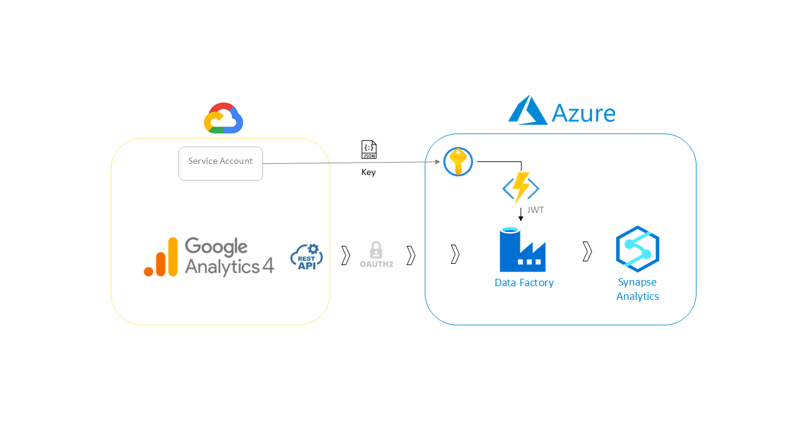

# Google Analytics 4 Data Extraction to Azure Synapse Pipelines
This repository contains the complete guide, scripts, and assets necessary to efficiently extract data from **Google Analytics 4 (GA4)** into **Azure Synapse Analytics**, utilizing **Azure Data Factory (ADF)**, **Azure Functions**, and **Parquet** format storage in **Azure Data Lake Storage (ADLS)**.

# Overview
The extraction process automates the OAuth2.0 authentication using a custom Azure Function to generate JWTs, allowing secure interaction with the Google Analytics Data API. The pipeline is designed to collect and store Google Analytics data in a structured, scalable format for further analysis.

# Key Features
- Automated JWT Generation: OAuth2.0 JWT generation via Azure Functions.
- Data Extraction from GA4: Leverages Google Analytics Data API to pull relevant data.
- Azure Data Factory Pipeline: Efficient orchestration of data flow.
- Parquet Format Storage: Data is stored in ADLS for optimal performance and scalability.
- Flattened JSON Handling: Data is transformed and stored in Parquet format, making it ready for downstream analysis.

# Setup Instructions
1. Google Cloud Setup
    - Enable Google Analytics Data API.
    - Create a service account and download the JSON key file.
      
2. Azure Setup
    - Create a Key Vault and Function App in Azure.
    - Configure Azure Data Factory and grant the necessary permissions.
      
3. Deploy the Azure Function
    - Use the provided Python function to handle JWT generation.
    - Deploy the function from Visual Studio Code, ensuring proper access to the Key Vault.
      
4. Configure the Pipeline in Azure Data Factory
    - Set up pipeline steps to call the Google Analytics Data API.
    - Store the extracted data in ADLS in Parquet format.

# Files in This Repository
- **Azure_Function**: Contains the Python script for JWT generation.
- **ADF_Pipeline**: JSON file detailing the ADF pipeline configuration.
- **Assets**: All supporting files and templates for creating datasets in ADF.
- **StepByStepGA2Az.pdf**: Complete step-by-step guide to replicate this process.

# Quickstart with Python Script (BuyMeACoffee)
For those who need a quick, script-based solution, I’ve developed a Python script that automates the entire process. This script is available under a [BuyMeACoffee paywall](
buymeacoffee.com/rafael.vera/e/315735), providing an efficient alternative to the Azure-based pipeline.

# Contributing
Feel free to submit issues or pull requests to improve this guide or code.
